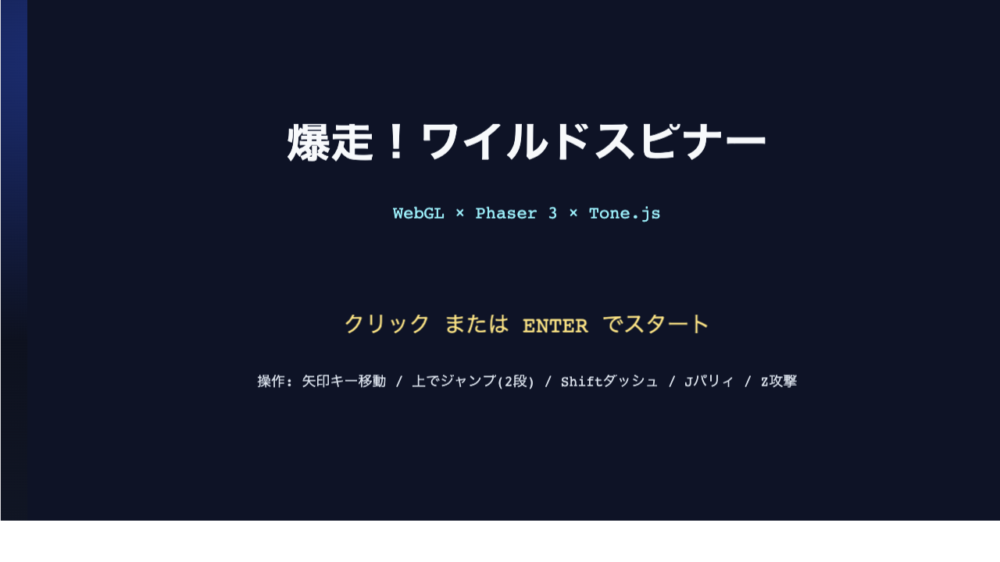
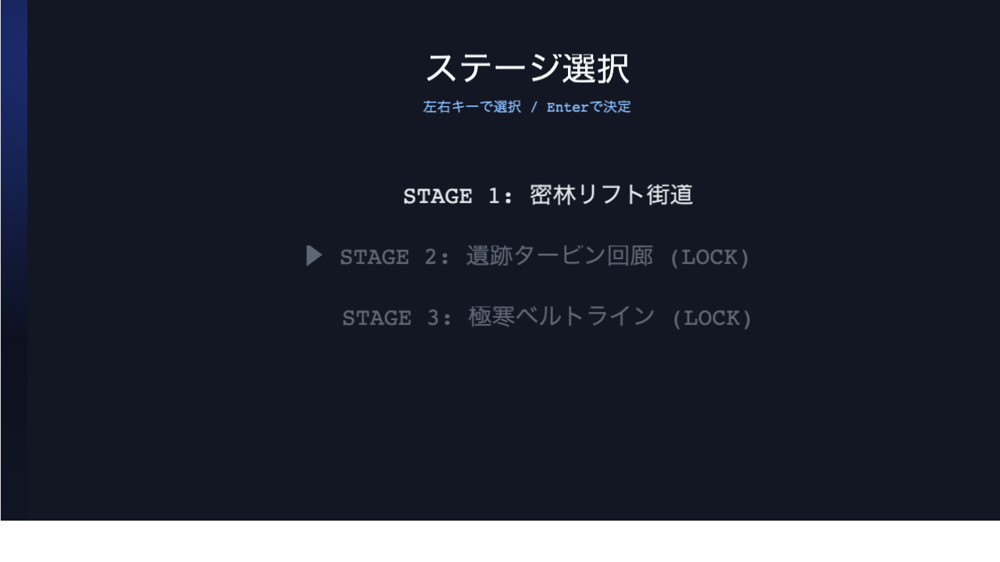

# 爆走！ワイルドスピナー (Wild Spinner)

Phaser 3 + TypeScript + Tone.js で制作している、ブラウザ向け高速アクションゲームの開発リポジトリです。  
3Dプラットフォーマーの手触りを意識しつつ、実装は WebGL + Arcade Physics をベースにしたオリジナル構成です。

## スクリーンショット

### タイトル画面



### ゲームプレイ画面



## プレイ動画

- MP4: [play-demo.mp4](public/media/play-demo.mp4)

## 更新履歴 (抜粋)

| 日付 | 変更概要 |
|---|---|
| 2026-04-24 | README を全面拡充 (技術スタック、操作、デバッグ、CI/CD、トラブルシュート) |
| 2026-04-24 | Stage 2/3 再入場停止バグを修正 (`StageScene` のランタイム初期化) |
| 2026-04-24 | クレート/フルーツ収集ループと結果画面連携を追加 |

## 公開URL

- GitHub Pages: https://remmakoshino.github.io/wild-spinner/
- デプロイ対象ブランチ: main

## 現在の実装ステータス

### 画面フロー

- タイトル
- ステージ選択
- ステージ本編 (Stage 1-3)
- リザルト

### プレイアクション

- 左右移動
- ジャンプ / 二段ジャンプ
- ダッシュ
- 近接攻撃
- パリィ

### ステージ・ギミック

- Stage 1: 基本操作導入 + クレート導入
- Stage 2: タービン上昇帯 / 移動床 / 射撃敵
- Stage 3: 氷結帯 / 崩落床 / 最終防衛ライン
- クレート3種類
  - fruit: 破壊でフルーツ獲得
  - bounce: 上から踏むと高跳躍
  - volatile: 接触で爆発リスク

### 難易度と進行

- 適応難易度 Tier 0-5
- ステージクリアでティアを再計算
- ティアに応じて敵強度 / 被ダメ / パリィ猶予を段階調整

### オーディオ

- Tone.js + Web Audio API
- 初回ユーザー入力で音声アンロック
- explore / battle / boss の小節境界遷移
- Threat Tier 連動で BPM / 和声密度 / 打楽器密度 / フィルタを変化

### HUD / リザルト表示

- HP / Tier / Combo / Enemy数 / BGM Section
- Fruit 数 / Crate 破壊数
- クリアタイム、Tier変化、収集状況

---

## 技術スタック

| 区分 | 採用技術 |
|---|---|
| ゲームエンジン | Phaser 3.90 |
| 言語 | TypeScript (strict) |
| ビルド | Vite 8 |
| 音楽 | Tone.js 14 + Web Audio API |
| テスト | Vitest |
| 静的解析 | ESLint |
| CI/CD | GitHub Actions |
| Hosting | GitHub Pages |

## 動作要件

- Node.js 22 系推奨 (CI と同系)
- npm
- WebGL 対応ブラウザ (Chrome / Edge / Safari / Firefox 最新版推奨)

---

## セットアップ

```bash
git clone https://github.com/remmakoshino/wild-spinner.git
cd wild-spinner
npm install
```

## ローカル実行

```bash
npm run dev
```

- 既定の開発URLは Vite の表示を参照
- GitHub Pages 相当のパスは /wild-spinner/

## 操作方法

| 入力 | 動作 |
|---|---|
| 左右キー | 移動 |
| 上キー | ジャンプ (二段ジャンプ対応) |
| Shift | ダッシュ |
| J | パリィ |
| Z | 攻撃 |
| Enter | タイトル開始 / ステージ決定 / リザルト復帰 |

---

## 開発用コマンド

```bash
npm run typecheck
npm run lint
npm run test
npm run build
npm run preview
npm run preview:check
npm run cli:debug
```

### 推奨デバッグ手順

1. 変更後に以下を実行

```bash
npm run cli:debug
```

2. 主要動線を手動確認

- タイトル -> ステージ選択 -> Stage 1/2/3 -> リザルト
- Stage 2 でタービン / 移動床動作
- Stage 3 で氷結帯 / 崩落床 / 最終増援動作
- Fruit / Crate の表示更新

---

## データ保存仕様

- localStorage キー: wild-spinner-save-v1
- 保存内容
  - 解放済みステージ
  - ベストタイム
  - 累計フルーツ
  - 難易度進行状態
  - オプション

### セーブを初期化したい場合

ブラウザ開発者ツール Console で実行:

```js
localStorage.removeItem('wild-spinner-save-v1')
```

---

## CI/CD と GitHub Pages

### 自動デプロイ

- main への push で deploy workflow が起動
- 処理内容
  - 依存インストール
  - typecheck
  - build
  - Pages Artifact upload
  - Pages deploy

### 運用確認コマンド例

```bash
gh run list -R remmakoshino/wild-spinner --workflow deploy.yml --limit 1
gh run view <run-id> -R remmakoshino/wild-spinner
curl -I https://remmakoshino.github.io/wild-spinner/
```

---

## リポジトリ構成 (主要部分)

```text
src/
  audio/
    AdaptiveMusicSystem.ts
    BgmSequencer.ts
    musicProfile.ts
  gameplay/
    MovementSystem.ts
    stageDefinitions.ts
  scenes/
    BootScene.ts
    TitleScene.ts
    StageSelectScene.ts
    StageScene.ts
    ResultScene.ts
  ui/
    HUD.ts
  utils/
    constants.ts
    difficulty.ts
    save.ts
tests/
  difficulty.test.ts
  music-profile.test.ts
  stage-definitions.test.ts
```

---

## トラブルシュート

### 音が鳴らない

- ブラウザの自動再生制限により、初回入力前は音声再生されません
- 画面クリックまたはキー入力後に再確認してください

### Stage 2 / Stage 3 で操作不能になる

- 再入場時のランタイム残留に起因する停止不具合は修正済みです
- 最新 main を取得して再確認してください

### ステージが LOCK のまま

- localStorage の保存状態が影響します
- 必要に応じてセーブ初期化後に再試行してください

---

## 著作権・開発ポリシー

本作は既存IPにインスパイアされた完全オリジナル作品として開発しています。  
固有キャラクター名・固有デザイン・固有演出・固有用語の直接流用は行いません。
